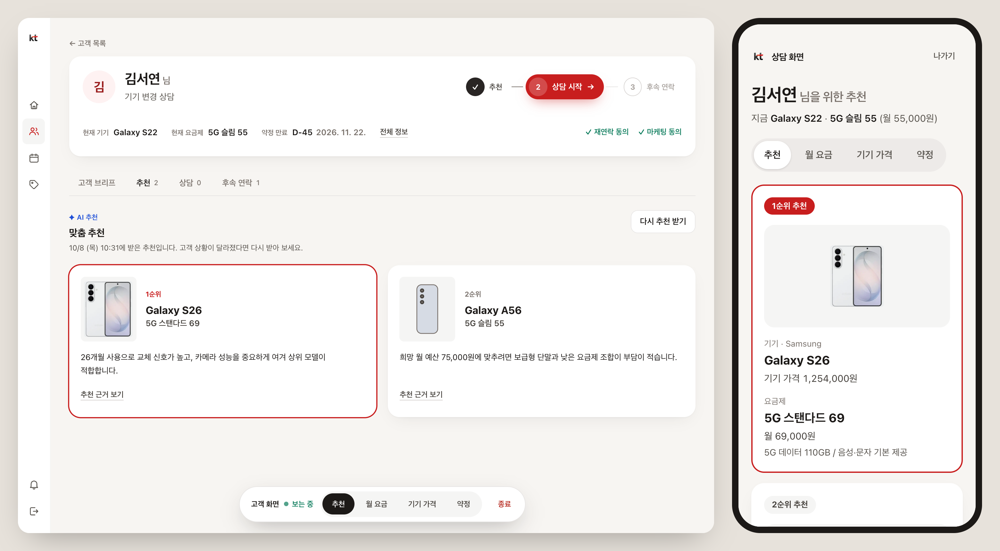
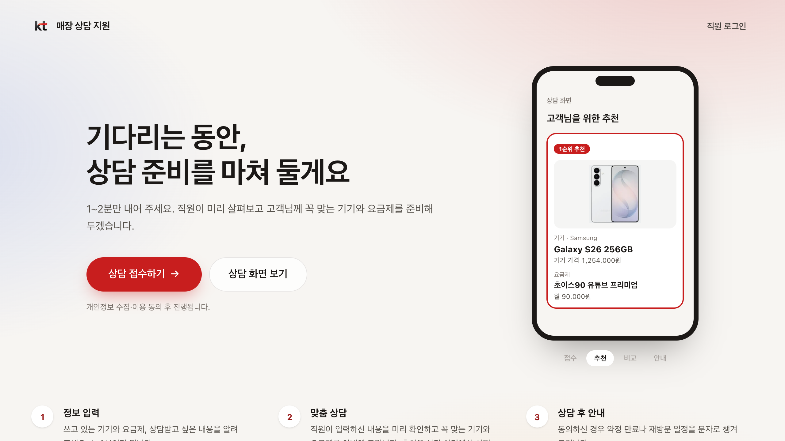
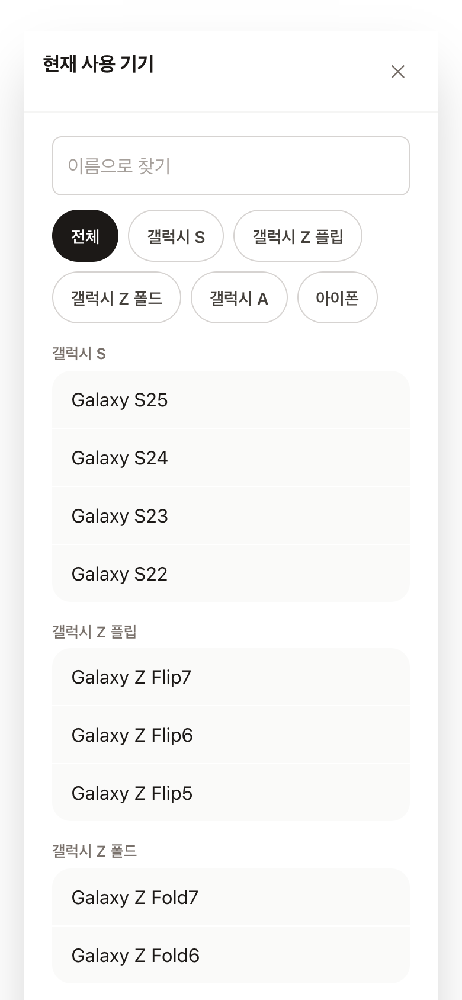
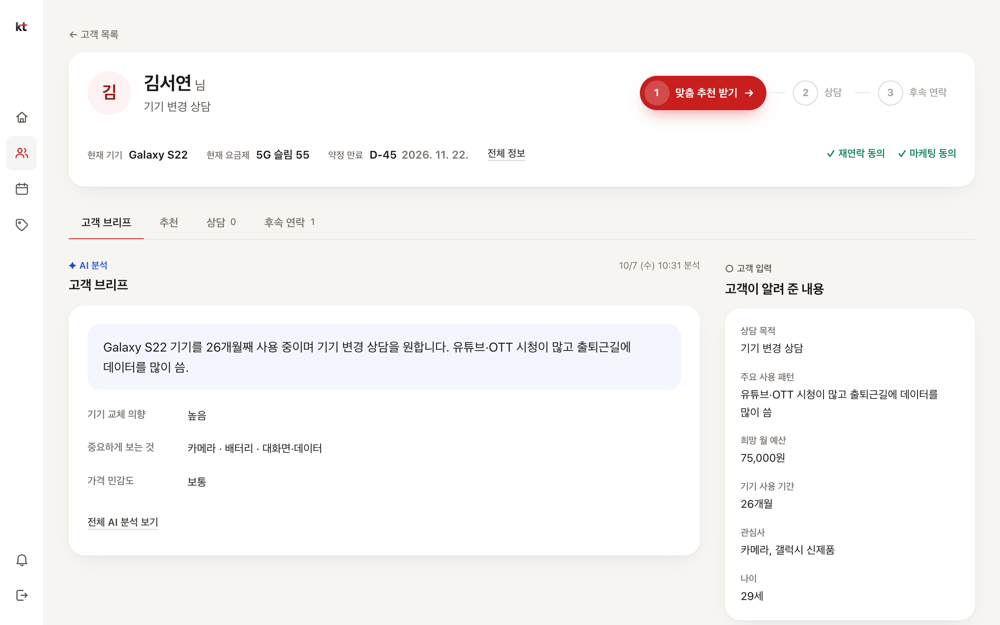
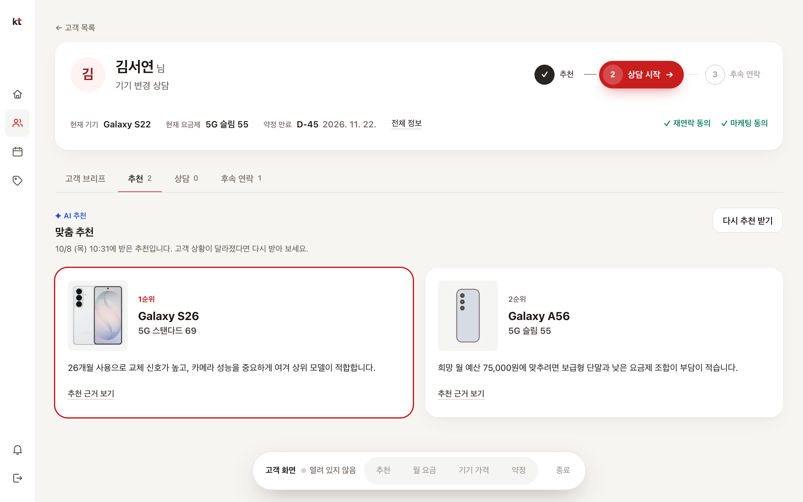
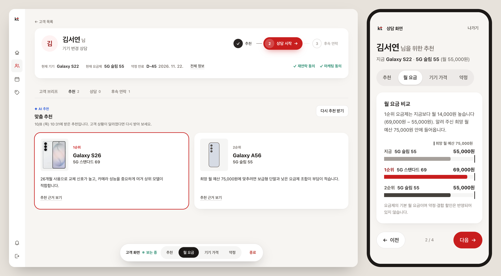
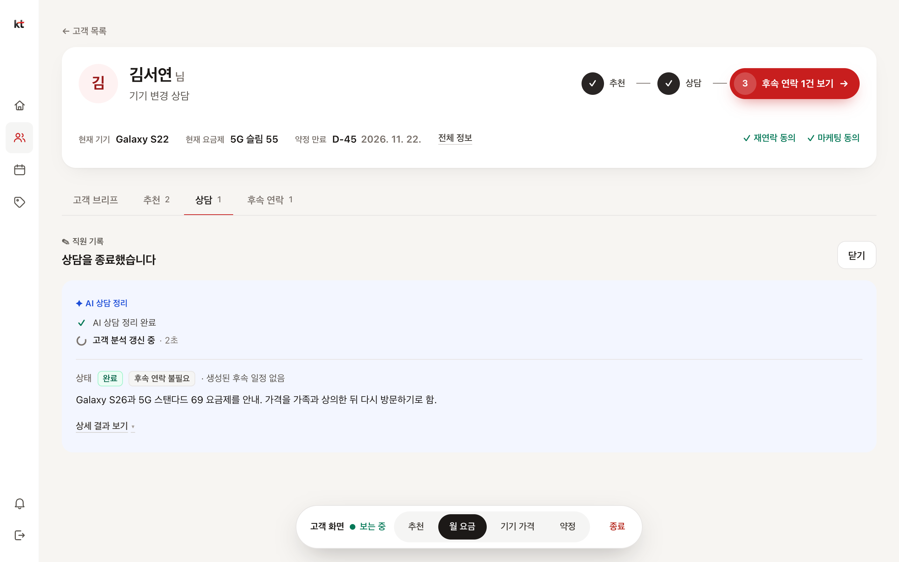
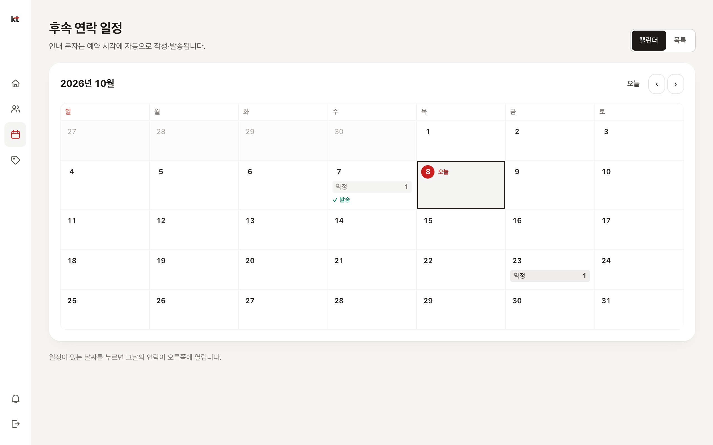
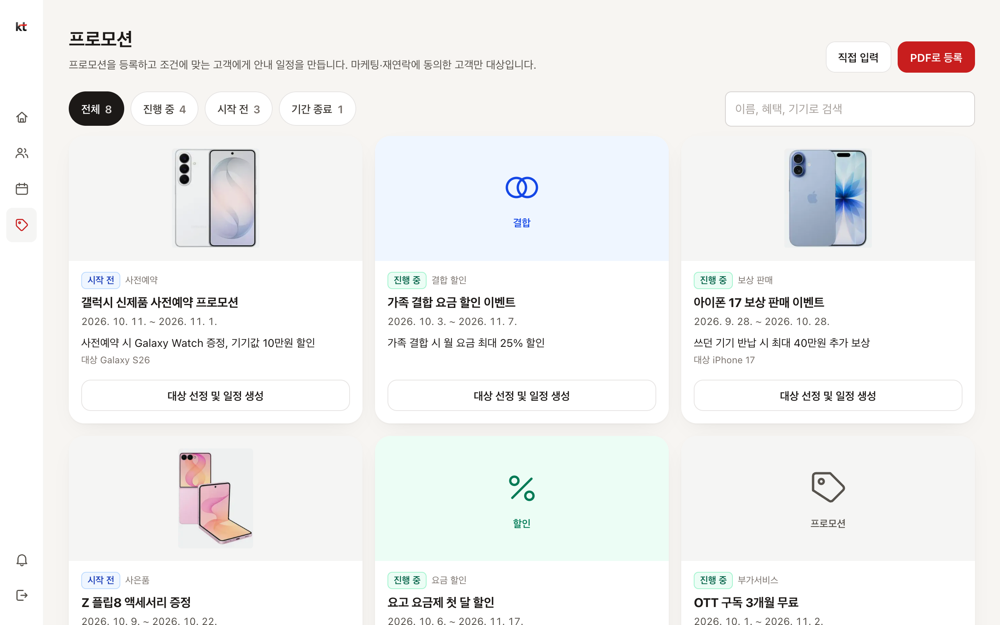

# KT 매장 상담 지원 AI Agent — 웹사이트

통신 매장에서 **고객이 접수하고, 직원이 AI의 분석과 추천을 받아 상담하고, 상담 뒤 안내 문자까지 이어지는** 흐름을 한 곳에서 다루는 웹사이트입니다.

- 배포 주소: https://consultant-web-beryl.vercel.app
- 아래 화면은 모두 샘플 데이터 모드에서 찍은 것입니다. 다시 찍으려면 `node scripts/readme-shots.mjs` 를 씁니다.
- 분석·추천·일정 계산·문자 생성은 n8n 워크플로우가 하고, 데이터는 Supabase에 있습니다. 이 저장소는 그것을 쓰는 화면과, 화면과 n8n을 잇는 게이트웨이입니다.



왼쪽이 직원 화면, 오른쪽이 고객의 휴대폰에 열린 상담 화면입니다. 화면 속 고객과 값은 모두 샘플 데이터입니다.

## 한 번의 방문을 따라가 보면

고객 한 명이 매장에 와서 상담을 받고 돌아가기까지입니다.

### 1. 고객이 기다리는 동안 접수합니다



매장의 QR이나 태블릿으로 첫 화면을 열고 [상담 접수하기]를 누릅니다. 동의 항목을 확인한 뒤, 지금 쓰는 기기와 요금제, 사용 패턴, 상담 목적을 고릅니다. 기기와 요금제는 매장의 실제 목록에서 검색해 고릅니다.

제출하면 AI가 고객을 분석하고(약 25초), 약정 만료일을 적었다면 만료 안내 일정이 만들어집니다. 고객은 기다릴 필요 없이 자리에 앉으면 됩니다.



### 2. 직원 화면에 새 고객이 바로 나타납니다

직원이 화면을 새로 고치지 않아도 "상담 대기"에 새 고객이 나타나고 알림이 뜹니다. 고객을 누르면 AI가 정리한 브리프(무엇을 원하는지, 기기를 바꿀 시기인지, 무엇을 중요하게 보는지)와 고객이 직접 적은 내용이 나란히 보입니다.

화면 위쪽의 **상담 순서 줄**(추천 → 상담 → 후속 연락)이 지금 할 일을 알려 줍니다.



### 3. 직원이 맞춤 추천을 받습니다

[맞춤 추천 받기]를 누르면 30~55초 뒤 추천이 순위별로 나옵니다. 매장의 실제 기기·요금제 목록과 등록된 프로모션 문서를 근거로 하며, 추천마다 이유와 적용 조건을 열어 볼 수 있습니다. 기다리는 동안에는 실제로 흐른 시간만 표시합니다.



### 4. 고객에게 화면으로 보여 주며 설명합니다

고객이 첫 화면의 [상담 화면 보기]에서 이름과 휴대폰 번호를 입력하면 자신의 추천이 열립니다. 화면은 스크롤 없이 한 장씩 넘어갑니다.

| 장 | 내용 |
|---|---|
| 추천 | 순위별 기기(사진, 가격)와 요금제(월 요금, 제공량) |
| 월 요금 | 지금 요금제와 추천 요금제의 비교. 희망 월 예산을 적었다면 그 위치도 표시 |
| 기기 가격 | 추천 기기끼리의 비교 |
| 약정 | 약정 만료까지 남은 기간, 지금 기기를 쓴 기간 |

**직원이 자기 화면에서 고객의 화면을 넘깁니다.** 고객이 화면을 열면 직원 화면 아래쪽 조작 띠에 "보는 중"이 표시되고, 직원이 [월 요금]을 누르면 고객의 화면이 2초 안에 그 장으로 바뀝니다. 상담이 끝나면 [종료]로 고객의 화면을 닫습니다.

그래프는 DB에 실제로 있는 값으로만 그리고, 계산한 값은 식을 함께 적습니다(예: "지금보다 월 14,000원 높습니다 (69,000원 − 55,000원)"). 이 화면은 저장된 추천을 읽기만 하고 AI를 부르지 않습니다.



직원이 아래쪽 조작 띠에서 [월 요금]을 누른 직후입니다. 오른쪽 고객 화면이 월 요금 비교 장으로 바뀌어 있습니다.

### 5. 상담 결과를 기록합니다

직원이 상담 메모를 자유롭게 적고, 고객이 다시 오기로 했다면 재상담 예정일을 넣어 저장합니다. AI가 메모를 요약하고 결과 상태와 관심 상품, 후속 연락 사유로 정리합니다. 재상담 예정일이 있으면 안내 일정이 만들어집니다.



### 6. 상담 뒤 안내 문자가 이어집니다

후속 연락 일정은 달력에서 봅니다. 예약된 시각이 되면 AI가 그 고객의 상담 내용을 담은 문자를 만들어 보냅니다. 직원이 미리 보내고 싶으면 [지금 발송]으로 AI 초안을 받아 확인하고 고친 뒤 보냅니다.



### 7. 프로모션이 생기면 맞는 고객에게 알립니다

프로모션 안내 PDF를 올리면 AI가 프로모션별로 나눠 주고, 직원이 확인한 뒤 등록합니다. [대상 선정]을 누르면 조건에 맞고 마케팅 수신에 동의한 고객을 고르고, 고객마다 안내 일정을 만듭니다.



## 주요 기능

| | 기능 |
|---|---|
| 고객 | 접수(동의, 기기·요금제 검색 선택) · 상담 화면(추천, 비교 그래프) |
| 직원: 상담 | 오늘 할 일 · 고객 목록과 검색 · AI 브리프 · 맞춤 추천과 근거 · 고객 화면 원격 조작 · 상담 기록과 AI 정리 |
| 직원: 상담 뒤 | 후속 연락 달력 · 문자 초안 확인 후 발송 · 프로모션 PDF 등록 · 대상 선정과 일정 생성 |
| 공통 | 새 고객·일정·발송 알림(새로 고침 없이) · 창 크기에 따른 화면 맞춤 |

## 구조

```
고객 (/join, /consult) ─┐
                        ├─ 웹사이트 서버 (/api/…) ─┬─ n8n 게이트웨이 ─ 워크플로우 F01~F07
직원 (/staff)          ─┘                          └─ Supabase (조회)
```

- **브라우저는 n8n이나 Supabase를 직접 부르지 않습니다.** 모두 웹사이트 서버를 거치므로 키와 개인정보 조회 권한이 브라우저에 나가지 않습니다.
- **쓰기는 n8n이 합니다.** 웹사이트는 조회만 합니다. 예외는 두 가지입니다: 프로모션 PDF 원본 보관, 고객 화면의 원격 조작 상태(`consult_screens`).
- **알림과 화면 갱신은 주기적 조회로 합니다.** 보고 있을 때는 2~3초, 조작이 없거나 탭이 가려지면 15~60초로 느려집니다.
- **기존 워크플로우에는 웹 진입점이 없어서 게이트웨이가 잇습니다.** 게이트웨이(`WF Main`)가 웹사이트의 요청을 받아 워크플로우를 순서대로 부릅니다. 게이트웨이는 `scripts/build-gateway.mjs` 로 생성합니다.

화면을 만들 때 지킨 원칙:

- 처음부터 모든 정보를 펼치지 않고 필요할 때 열어 본다.
- 없는 데이터(점수, 통계)를 화면에 만들지 않는다.
- 기다리는 동안에는 실제 신호와 실제로 흐른 시간만 보여 준다. 가짜 진행률을 쓰지 않는다.
- AI가 만든 내용, 고객이 입력한 내용, 직원이 적은 내용을 구분해 표시한다.

| 워크플로우 | 하는 일 |
|---|---|
| F01 | 고객 정보와 동의 저장 |
| F02 | 고객 분석 |
| F03 | 맞춤 추천 |
| F04 | 상담 결과 정리 |
| F05 | 프로모션 대상 선정 |
| F06 | 안내 일정 만들기 (약정 만료, 재상담, 프로모션) |
| F07 | 문자 만들기와 발송 |
| 매일 자동 발송 | 09시와 18시에 그날 예정된 일정을 발송 |

## 실행

```bash
npm install
cp .env.example .env.local
npm run dev
```

http://localhost:3000 을 엽니다. 기본은 **샘플 데이터 모드**(`USE_MOCK=true`)라서 n8n과 Supabase 없이 전체 흐름이 동작합니다. 이 모드에서는 직원 로그인에 비밀번호가 필요 없습니다.

샘플 데이터는 서버 메모리에 있어 개발 서버를 다시 시작하면 처음 상태로 돌아갑니다. 로컬 전용입니다.

원격 조작을 한 컴퓨터에서 해 보려면 창을 두 개 나란히 띄웁니다. 한쪽은 `/staff` 에서 고객 상세를 열어 추천을 받고, 다른 쪽은 `/consult` 에서 그 고객의 이름과 번호로 엽니다. 샘플 고객은 `lib/backend/mock.ts` 에 있습니다.

### 환경변수

모두 서버 전용입니다. `NEXT_PUBLIC_` 접두사를 붙이지 않습니다. `.env.local` 은 저장소에 올라가지 않습니다.

| 이름 | 설명 |
|---|---|
| `USE_MOCK` | `true`(기본)면 샘플 데이터, `false`면 실제 n8n·Supabase 연동 |
| `N8N_BASE_URL` | 게이트웨이 webhook 기본 주소 |
| `N8N_WEB_SECRET` | 게이트웨이 Webhook 노드의 Header Auth(`x-web-secret`) 값 |
| `SUPABASE_URL` | Supabase 프로젝트 주소 |
| `SUPABASE_SERVICE_ROLE_KEY` | 서버에서 조회할 때 쓰는 키. **커밋하지 않습니다** |
| `STAFF_DEMO_PASSWORD` | 직원 로그인 공용 비밀번호 |
| `STAFF_DEFAULT_ID` | (선택) 로그인 화면에서 처음 선택되어 있을 직원 |
| `SESSION_SECRET` | 세션 쿠키 서명용 임의 문자열 (`openssl rand -hex 32`) |
| `N8N_API_KEY` | (선택) `npm run n8n:export` 로 워크플로우를 내보낼 때만 사용 |

실제 연동으로 바꾸는 방법, n8n에 워크플로우를 올리는 방법, 경로별 확인 방법은 [docs/n8n-연동.md](docs/n8n-연동.md)에 있습니다.

### 검사

```bash
npx tsc --noEmit && npx eslint app lib components
```

PR마다 타입 검사, 린트, 게이트웨이 확인, 빌드가 돌고, `main` 에 병합하면 Vercel에 배포됩니다.

## 저장소 구성

```
app/                     화면과 API
  page.tsx               첫 화면
  join/                  고객 접수
  consult/               고객 상담 화면
  staff/                 직원 화면 (로그인 필요)
  api/                   Route Handler. 브라우저는 여기만 부른다
components/              화면 조각 (공통은 ui.tsx)
lib/
  backend/               데이터 접근. index.ts(인터페이스), mock.ts(샘플), real.ts(실제 연동)
  n8n.ts                 n8n 호출은 모두 이 파일을 거친다
  usePolling.ts          주기적 조회
  fields.ts              고객 접수 항목과 문구
n8n/
  workflows/             n8n에서 발행된 워크플로우를 내보낸 것
  parts/, web-gateway.json   게이트웨이 (생성물)
scripts/                 게이트웨이 생성, 워크플로우 내보내기, README 사진 찍기
docs/                    연동 문서와 README 사진
public/
  devices/               기기 사진
  viewport-scale.js      창 크기에 따라 화면 전체를 축소
```

Next.js 16, React 19, TypeScript, Tailwind CSS 4를 씁니다.

## 알아 둘 점

- **문자는 실제로 발송되지 않습니다.** 발송 단계가 모의(MOCK)라서 DB에 발송 완료로 기록될 뿐입니다.
- **고객 상담 화면은 이름과 휴대폰 번호만으로 열립니다.** 그래서 전화번호, 상담 메모, AI 분석, 추천 이유는 이 화면에 내보내지 않습니다. 확인 시도는 10분에 5번으로 제한합니다.
- **자동 발송에는 직원 검토 단계가 없습니다.** 검토는 [지금 발송]에만 있습니다.
- **창 크기**: 1200px 이상은 내용이 화면을 채우고, 640~1200px 은 같은 화면을 비율대로 축소하며, 그보다 좁으면 휴대폰용 배치로 바뀝니다.
- **공개 저장소입니다.** `n8n/workflows` 에는 테스트 데이터와 캘린더 ID를 빼고 저장하며, 자격증명은 이름만 들어 있습니다.
